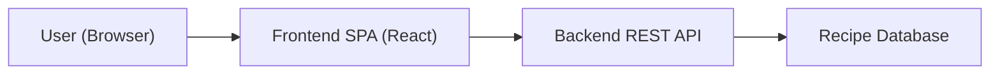

# Recipe Recommender Web App - Architecture Document

## System Overview
This React SPA provides a responsive frontend for users to search and view recipes. It integrates with a backend via REST and adheres to GxP ALCOA+ principles by attaching attribution metadata in requests. The frontend avoids durable storage of sensitive data and relies on the backend for authentication, authorization, persistence, and audit trail storage.

## Context and Container Diagram (C4 Level 1/2 description)
- Context: User (Browser) → Recipe Recommender Frontend (React SPA) → Backend REST API → Recipe Database.
- Containers:
  - Frontend (this repo): React with component/state architecture, services for API/audit.
  - Backend (external): Provides recommendation, recipes, audit endpoints.
  - Data store (external): Recipes database managed by backend.



## Frontend Architecture (React)
### State Management, Routing, Components, Services
- State: Component-level state with hooks; contexts for Auth and Theme.
- Routing: Routes defined in src/routes.jsx covering "/", "/recipes", "/recipe/:id", and a protected "/saved".
- Components:
  - Layout: Topbar.jsx, Sidebar.jsx
  - Recipes: RecipeSearchForm.jsx, RecipeList.jsx, RecipeDetail.jsx
  - Common: Loading.jsx, ErrorBanner.jsx
- Services:
  - apiClient.js: Fetch wrapper, base URL from REACT_APP_API_BASE_URL, attaches Authorization and x-user-id/x-action/x-timestamp when provided, with normalized error handling.
  - auditClient.js: Emits audit events to REACT_APP_AUDIT_API_BASE_URL/audit (non-blocking).
  - internalAuthSnapshot.js: Provides token snapshot to services.
- Contexts:
  - AuthContext.jsx: Manages user and token, provides role-aware UI decisions.
  - ThemeContext.jsx: Persists and applies light/dark theme via data-theme and CSS tokens.

## API Integration Patterns and DTOs
- Recommendation request (POST /recommendations):
  - Request DTO:
    ```json
    {
      "ingredients": "string",
      "preferences": ["string"],
      "cuisine": "string|null",
      "maxTime": 0,
      "page": 0,
      "size": 10,
      "sort": "relevance|prepTime|title",
      "metadata": { "userId": "string", "action": "READ", "timestamp": "ISO-8601" }
    }
    ```
  - Response DTO:
    ```json
    { "items": [{ "id": "string", "title": "string", "prepTime": 0 }], "page": 0, "size": 10, "total": 0 }
    ```
- Recipe detail (GET /recipes/{id}):
  - Response DTO contains id, title, ingredients[], steps[], optional nutrition{}.

## Security Architecture (RBAC, auth context placeholders)
- RBAC awareness in UI via AuthContext; conditional navigation and pages (e.g., /saved).
- Backend is source of truth for authorization; frontend avoids exposing privileged operations without backend checks.
- Tokens are read through an internal snapshot to avoid hook dependencies in services; in production use secure cookies/SSO.

## Audit and Logging Strategy (frontend events, traceability hooks)
- Each API call can include attribution headers; apiClient test verifies headers.
- auditClient emits events such as search_submit and recipe_view; failures are swallowed to avoid user disruption.
- Timestamps are generated contemporaneously using new Date().toISOString().

## Validation Strategy (client-side, cross-field, business rules)
- Client-side validation in RecipeSearchForm.jsx:
  - Required ingredients with max length.
  - Whitelisted dietary and cuisine selects.
  - Max time numeric, positive, ≤ 600.
- RecipeList.jsx and RecipeDetail.jsx handle empty/nullable API fields defensively.

## Error Handling and Resilience Patterns
- ErrorBanner provides friendly messages and optional retry.
- apiClient normalizes error messages and throws with status.
- Non-blocking audit emissions; empty state rendering on no results.

## Performance and Caching Strategy
- Debounced user input can be applied (pattern ready).
- Pagination and sorting minimize render load.
- Simple in-memory caching via component state; CRA build optimizations for static assets.

## Accessibility (a11y) and i18n Strategy
- ARIA attributes and roles on forms, lists, and banners.
- Visible focus and adequate color contrast per theme.
- Text content structured for future i18n extraction.

## Testing Strategy (unit, integration, validation, coverage goals)
- Unit tests: apiClient headers and error handling; RecipeSearchForm validation and submission; RecipeList pagination/sorting.
- Integration tests: rendering flows, routing navigation, and mocked API.
- Validation tests: confirm audit metadata presence and input constraints.
- Coverage: CI threshold target ≥ 80%.

## Deployment and Environments
- Frontend runs at port 3000; API base URLs defined by:
  - REACT_APP_API_BASE_URL
  - REACT_APP_AUDIT_API_BASE_URL
- Backend must enable CORS for http://localhost:3000 in development.

## Observability and Metrics
- Client-side metrics can include simple timing and error banner counts in future.
- Leverage audit events for high-level traceability without PII exposure.

## Compliance Mapping to Code Structure Template
- Requirement Traceability: See docs/Traceability_Matrix.md mapping REQ-* to files and tests.
- Validation Protocols: Test_Strategy.md and Compliance_Validation_Plan.md define validation controls and audit checks.
- API Documentation: Defined in this document’s DTO sections and PRD API Dependencies.
- Release Gate Checklist: Mirrored in Compliance_Validation_Plan.md and summarized below.

## Release Gate Checklist Alignment
- Inputs validated at all entry points (RecipeSearchForm.jsx).
- Audit attribution metadata attached in apiClient and auditClient usage.
- Error handling via ErrorBanner and normalized errors.
- Accessibility checks integrated in tests.
- Unit coverage ≥ 80%; integration tests passing.
- Documentation: PRD, Architecture, Test Strategy, Compliance & Validation Plan, Traceability Matrix present.

## Actionable Next Steps
- Expand DTO schema validation in services if backend schemas are finalized.
- Add debounce utility hook and memoized selectors for lists.
- Add basic telemetry hook (event timings) respecting privacy constraints.
